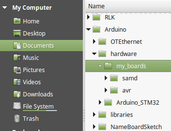

Arduino IDE and Arduino builder support custom board definitions from [hardware subfolder](https://arduino.github.io/arduino-cli/platform-specification/) of your sketches folder. This definitions can use core classes and tools from installed board packages.

This GitHub repository contains my settings for boards I use for my project and to develop Arduino libraries. You can use it as starting point for your boards specialties.

All boards in this repo are only additions to installed 'official' board packages. My files contain only definition of the board in boards.txt, the folder in variants and platform.txt file contains only additional entries. The file programmers.txt contains sample definitions of 'programmer' entries for OTA upload without the IDE detecting the network port.

## Boards

### AVR architecture

Boards defined here use build of [Optiboot bootloader with `copy_flash_pages` function](https://github.com/Optiboot/optiboot/pull/269) (for ArduinoOTA library). platform.txt contains entries for sketch upload over network to ArduinoOTA library. All boards refer official Arduino AVR core and tools.

The official Arduino Mega doesn't use Optiboot bootloader. It has a 4 kB bootloader. The board definition here is changed to respect 1 kB Optiboot bootloader. The AVR package can use arduino:mega as variant reference to official package, so the variants folder doesn't need to be copied here. 

I have [a small series ATmega1284p board](https://github.com/budvar10/Arduino-ATmega1284P) by budvar10. It has perfect Uno pins compatibility. The pin mapping in variants is copied from budvar10's repo.

### SAMD architecture

platform.txt contains an entry for remote upload, that is missing in the official package.

The Arduino Zero bootloader is much better then the arduino.org M0 bootloader. Board definition "Arduino M0 (Zero bootloader)" has M0 pin definitions, but samba upload definitions for Zero bootloader. Burn the bootloader with Zero selected in the Arduino boards package. 

The variants/arduino_mzero folder is copied from the Arduino SAMD package, but my M0 doesn't have the EDGB programmer chip so I removed the SERCOM configuration for Serial (over EDBG) and aliased Serial to SerialUSB, so I can use Serial in all sketches and libraries.

### STM32 architecture

boards.txt contains my combinations of optional settings for Blue Pill board with 128kB flash with the official STM32 Arduino boards package.

### nRF5 architecture

I have a Seeed Arch Link nRF51 board, which is not yet in Sandeep Mistry's Nordic Semiconductor nRF5 Boards release.